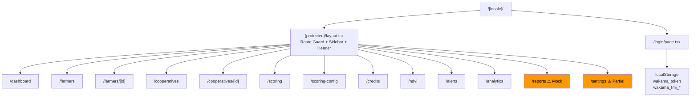
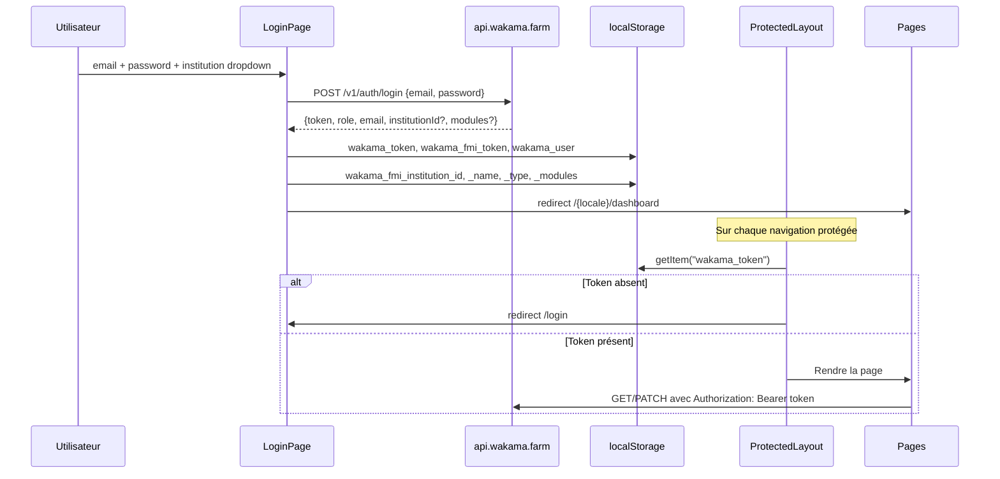
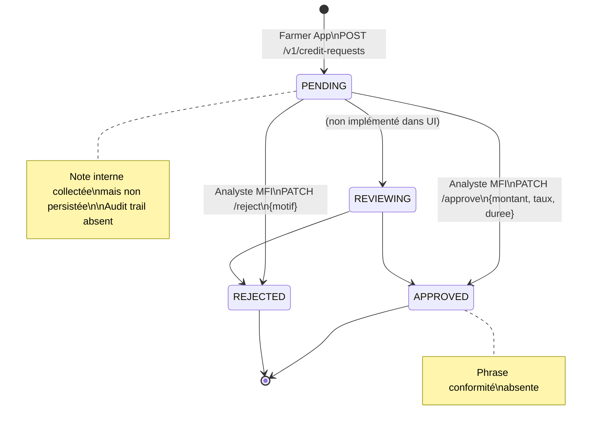
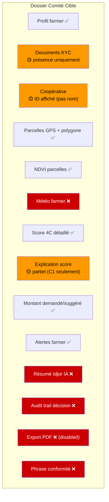

# Audit FMI Dashboard — Wakama

> **Date de l'audit :** 2026-05-02  
> **Auditeur :** Claude Sonnet 4.6 (audit statique, aucune modification de code)  
> **Repo :** `fmi-dashboard`  
> **Environnement :** WSL / Windows 11  

---

## Table des matières

1. [Résumé exécutif](#1-résumé-exécutif)
2. [Stack technique détectée](#2-stack-technique-détectée)
3. [Architecture des dossiers](#3-architecture-des-dossiers)
4. [Routes existantes](#4-routes-existantes)
5. [Layout / Shell / Sidebar / Header](#5-layout--shell--sidebar--header)
6. [Authentification et session institutionnelle](#6-authentification-et-session-institutionnelle)
7. [Gestion des rôles institutionnels](#7-gestion-des-rôles-institutionnels)
8. [API client et endpoints consommés](#8-api-client-et-endpoints-consommés)
9. [Page Login](#9-page-login)
10. [Page Dashboard](#10-page-dashboard)
11. [Page Farmers](#11-page-farmers)
12. [Page Farmer Détail](#12-page-farmer-détail)
13. [Page Cooperatives](#13-page-cooperatives)
14. [Page Cooperative Détail](#14-page-cooperative-détail)
15. [Page Scoring & Risques](#15-page-scoring--risques)
16. [Page Configuration Scoring](#16-page-configuration-scoring)
17. [Page Demandes de crédit](#17-page-demandes-de-crédit)
18. [Page NDVI](#18-page-ndvi)
19. [Page Alertes](#19-page-alertes)
20. [Page Analytics](#20-page-analytics)
21. [Page Reports](#21-page-reports)
22. [Page Settings](#22-page-settings)
23. [Composants UI réutilisables](#23-composants-ui-réutilisables)
24. [Gestion des scores / 4C](#24-gestion-des-scores--4c)
25. [Gestion des demandes de crédit](#25-gestion-des-demandes-de-crédit)
26. [Gestion des alertes / monitoring](#26-gestion-des-alertes--monitoring)
27. [Gestion des exports / rapports](#27-gestion-des-exports--rapports)
28. [Mocks, fallbacks, données codées en dur](#28-mocks-fallbacks-données-codées-en-dur)
29. [Écarts avec le backend actuel](#29-écarts-avec-le-backend-actuel)
30. [Écarts avec la Farmer App](#30-écarts-avec-la-farmer-app)
31. [Écarts avec la vision Wakama institutionnelle](#31-écarts-avec-la-vision-wakama-institutionnelle)
32. [Ce qui manque pour un vrai moteur de préqualification FMI](#32-ce-qui-manque-pour-un-vrai-moteur-de-préqualification-fmi)
33. [Ce qui manque pour un dossier comité complet](#33-ce-qui-manque-pour-un-dossier-comité-complet)
34. [Ce qui manque pour audit trail / conformité](#34-ce-qui-manque-pour-audit-trail--conformité)
35. [Roadmap technique P0 / P1 / P2](#35-roadmap-technique-p0--p1--p2)
36. [Annexes avec schémas Mermaid](#36-annexes-avec-schémas-mermaid)

---

## 1. Résumé exécutif

Le FMI Dashboard est une application Next.js 16 (React 19) de type "dark fintech" construite pour permettre à des institutions financières (MFI, banques agricoles, assureurs) de consulter, scorer et préqualifier des farmers agricoles enregistrés via la Farmer App Wakama.

**État global :** Le socle technique est solide. Toutes les routes principales existent et se connectent réellement à l'API `https://api.wakama.farm`. Les pages Farmers, Farmer Détail, Cooperatives, Scoring, Credits, NDVI et Alertes sont fonctionnelles avec des données réelles.

**Points forts identifiés :**
- Architecture Next.js 16 App Router, TypeScript strict, Tailwind 4
- API client centralisé (`src/lib/api.ts`) avec gestion Bearer token
- Scoring config institution-specific (localStorage + backend PATCH)
- Pages riches : Farmer détail affiche profil, score 4C, parcelles, KYC, crédits, alertes
- Scoring page avec distribution, par filière, par région, simulateur de poids
- Config Scoring avec 5 onglets : pondération 4C, règles par critère, produits, conditions crédit, profil de risque

**Lacunes critiques (P0) :**
- Pas d'isolation multi-tenant réelle : les données ne sont pas filtrées par `institutionId` côté API — la cloison est cosmétique
- Token de protection de route vérifie `wakama_token` mais l'API client lit `wakama_token` : ces deux clés sont bien synchronisées au login mais créent une dépendance fragile (voir section 6)
- La page Reports est 100% mock (données statiques, génération simulée avec setTimeout)
- Pas d'audit trail des décisions crédit
- Sauvegarde profil et notifications dans Settings : simulations (`setTimeout`) sans appel API

**Lacunes structurelles (P1) :**
- Aucun résumé Idjor / IA institutionnel
- Pas d'historique de score (évolution temporelle fakée)
- Pas de suivi post-crédit / remboursement
- Pas de dossier comité exportable
- KYC : seule la présence de `cniUrl` est vérifiée — pas d'URL réelle cliquable

---

## 2. Stack technique détectée

| Catégorie | Technologie | Version | Notes |
|-----------|------------|---------|-------|
| Framework | Next.js | **16.2.1** | App Router, `[locale]` routing |
| Runtime UI | React | 19.2.4 | Concurrent features |
| Langage | TypeScript | ^5 | strict mode apparent |
| CSS | Tailwind CSS | ^4 | Avec `@tailwindcss/postcss` |
| Charts | Recharts | ^3.8.1 | AreaChart, BarChart, PieChart |
| Cartes | Leaflet + react-leaflet | 1.9.4 / ^5.0.0 | Chargement dynamique (SSR disabled) |
| Auth | Custom (localStorage) | — | Pas NextAuth, pas JWT parse |
| API client | `fetch` natif | — | Helper `apiFetch` centralisé |
| Dark/light mode | `lib/theme.ts` | — | Toggle implémenté |
| i18n | Routing `[locale]` uniquement | — | Pas de bibliothèque i18n, pas de traductions |
| Déploiement prévu | Non renseigné | — | `next.config.ts` vide |
| Variables d'env | Aucune `.env*` détectée | — | `BASE_URL` hardcodé dans `api.ts` |

**Scripts package.json :**
```json
{
  "dev":   "next dev",
  "build": "next build",
  "start": "next start",
  "lint":  "eslint"
}
```

**Dépendances directes de production :**
- `next` 16.2.1, `react` 19.2.4, `react-dom` 19.2.4
- `leaflet` 1.9.4, `react-leaflet` ^5.0.0, `@types/leaflet` ^1.9.21
- `recharts` ^3.8.1

**Absence notable :** aucune dépendance pour :
- Authentification (pas d'Axios, pas de NextAuth, pas de react-query)
- Gestion d'état global (pas de Zustand, Redux, Jotai)
- Validation de formulaires (pas de Zod, react-hook-form)
- Tests (pas de Vitest, Jest)
- PDF generation (pas de pdfmake, @react-pdf/renderer)

---

## 3. Architecture des dossiers

```
fmi-dashboard/
├── app/
│   ├── globals.css              # Styles globaux + variables CSS custom
│   ├── layout.tsx               # Root layout (body, fonts)
│   ├── page.tsx                 # Root → redirect vers /fr/dashboard
│   ├── favicon.ico
│   └── [locale]/
│       ├── layout.tsx           # Locale layout (await params, rien de plus)
│       ├── not-found.tsx        # 404 localisé
│       ├── login/
│       │   └── page.tsx         # Page login
│       └── (protected)/
│           ├── layout.tsx       # Guard auth + Sidebar + Header
│           ├── dashboard/       # Tableau de bord
│           ├── farmers/         # Liste + détail farmer
│           │   └── [id]/
│           ├── cooperatives/    # Liste + détail coopérative
│           │   └── [id]/
│           ├── scoring/         # Scoring & Risques
│           ├── scoring-config/  # Configuration scoring
│           ├── credits/         # Demandes de crédit
│           ├── ndvi/            # NDVI Satellite
│           ├── alerts/          # Alertes
│           ├── analytics/       # Analytiques
│           ├── reports/         # Rapports (mock)
│           └── settings/        # Paramètres
│
├── src/
│   ├── components/
│   │   ├── layout/
│   │   │   ├── Sidebar.tsx      # Navigation principale (11 items)
│   │   │   └── Header.tsx       # Barre du haut (breadcrumb, alertes, user, logout)
│   │   └── ui/
│   │       ├── AlertBadge.tsx   # Badge sévérité d'alerte
│   │       ├── Badge.tsx        # Badge générique
│   │       ├── Button.tsx       # Bouton réutilisable
│   │       ├── Card.tsx         # Card wrapper
│   │       ├── ChartTooltip.tsx # Tooltip pour Recharts
│   │       ├── CoopMap.tsx      # Carte Leaflet coopératives
│   │       ├── DataTable.tsx    # Table générique
│   │       ├── KPICard.tsx      # Carte KPI (label, valeur, icône, couleur)
│   │       ├── NdviMap.tsx      # Carte Leaflet NDVI
│   │       ├── PageLoader.tsx   # Spinner de chargement de page
│   │       ├── ParcellesNdviMap.tsx  # Carte parcelles avec overlay NDVI
│   │       ├── PlatformMap.tsx  # Carte plateforme (farmers + coops + parcelles)
│   │       ├── RangeConfig.tsx  # Double slider min/max
│   │       ├── ScoreGauge.tsx   # Jauge SVG score + détail 4C
│   │       └── SliderInput.tsx  # Slider avec label + valeur
│   ├── lib/
│   │   ├── api.ts               # Client API centralisé (tous endpoints)
│   │   ├── auth.ts              # Helpers localStorage institution
│   │   ├── geoUtils.ts          # Utilitaires géographiques
│   │   ├── scoringConfig.ts     # Config scoring (types, défauts, helpers)
│   │   ├── theme.ts             # Dark/light mode toggle
│   │   └── utils.ts             # formatFCFA, scoreColor, relativeTime, exportCSV...
│   └── types/
│       └── index.ts             # Tous les types TypeScript du projet
│
├── public/
│   └── wakama-logo.png          # (présumé, référencé dans Sidebar + Login)
├── AGENTS.md                    # Instructions agents IA
├── CLAUDE.md                    # Référence AGENTS.md
├── SPEC.md                      # Spec du projet
├── WAKAMA_CONTEXT.md            # Contexte Wakama
├── WAKAMA_SESSION_CR.md         # Compte-rendus sessions
├── next.config.ts               # Vide (options par défaut)
├── package.json
└── tsconfig.json
```

**Niveau de maturité par dossier :**

| Dossier | Maturité | Notes |
|---------|----------|-------|
| `app/(protected)/` | Élevée | Toutes les routes principales présentes |
| `src/lib/api.ts` | Élevée | Tous les endpoints définis, gestion erreurs OK |
| `src/lib/scoringConfig.ts` | Élevée | Config complète, locale + backend |
| `src/types/` | Élevée | Types complets, gestion des variants API |
| `src/components/ui/` | Moyenne-élevée | Composants fonctionnels mais pas de Storybook |
| `app/(protected)/reports/` | Faible | 100% statique/mock |

---

## 4. Routes existantes

| Route | Fichier | Statut | Rôle | Appels API | Données affichées | Remarques |
|-------|---------|--------|------|------------|-------------------|-----------|
| `/[locale]/login` | `login/page.tsx` | ✅ Complet | Tous | `POST /v1/auth/login` | Formulaire | Institution sélectionnée (dropdown hardcodé) |
| `/[locale]/dashboard` | `dashboard/page.tsx` | ✅ Fonctionnel | Tous | farmers, coops, alerts, credits, scores, parcelles | KPIs, graphiques, carte, demandes, alertes | Evolution score historique fakée |
| `/[locale]/farmers` | `farmers/page.tsx` | ✅ Fonctionnel | Tous | farmers, coops, scores | Table paginée, carte, KPIs | Pagination server-side (20/page) |
| `/[locale]/farmers/[id]` | `farmers/[id]/page.tsx` | ✅ Fonctionnel | Tous | farmer, score, parcelles, alerts, credits | Profil, KYC, score 4C, parcelles, crédits, alertes | Rapport PDF désactivé |
| `/[locale]/cooperatives` | `cooperatives/page.tsx` | ✅ Fonctionnel | Tous | coops, scores coop | Table filtrée | Score coop chargé |
| `/[locale]/cooperatives/[id]` | `cooperatives/[id]/page.tsx` | ✅ Fonctionnel | Tous | coop, score coop, farmers, scores, iot, parcelles | Profil, score, membres, NDVI, IoT, financier | Rapport PDF désactivé |
| `/[locale]/scoring` | `scoring/page.tsx` | ✅ Fonctionnel | Tous | farmers, scores | Distribution, par filière, par région, simulateur | Limité à 100 farmers |
| `/[locale]/scoring-config` | `scoring-config/page.tsx` | ✅ Fonctionnel | Admin | `PATCH /v1/institutions/:id/scoring-config` | 5 onglets config | GET config non implémenté |
| `/[locale]/credits` | `credits/page.tsx` | ✅ Fonctionnel | Tous | credits, farmers, scores | Pipeline PENDING/APPROVED/REJECTED, approve/reject | Filtrage institutionId conditionnel |
| `/[locale]/ndvi` | `ndvi/page.tsx` | ✅ Fonctionnel | Tous | farmers, parcelles | Carte + table parcelles NDVI | Limité 50 farmers |
| `/[locale]/alerts` | `alerts/page.tsx` | ✅ Fonctionnel | Tous | alerts, farmers, coops | Cards alertes, filtres, mark read | Pagination cliente |
| `/[locale]/analytics` | `analytics/page.tsx` | ✅ Fonctionnel | Tous | farmers, scores, credits | 5 graphiques Recharts | Limité 200 farmers |
| `/[locale]/reports` | `reports/page.tsx` | ⚠️ Mock | Tous | Aucun | Listes statiques | Génération simulée (setTimeout) |
| `/[locale]/settings` | `settings/page.tsx` | ⚠️ Partiel | Tous | `GET /v1/auth/me` | Profil, API key, notifs, scoring | Sauvegardes non fonctionnelles |

**Légende :** ✅ Fonctionnel (données réelles) · ⚠️ Partiel ou mock · ❌ Absent

---

## 5. Layout / Shell / Sidebar / Header

### Protected Layout (`app/[locale]/(protected)/layout.tsx`)

- Vérifie `localStorage.getItem("wakama_token")` au montage
- Si absent → redirect `/{locale}/login`
- Si `wakama_user` corrompu → clear + redirect
- Structure : `Sidebar (220px fixe) + flex-col(Header 48px + main scroll)`

### Sidebar (`src/components/layout/Sidebar.tsx`)

- 11 éléments de navigation en 3 sections : Principal, Portefeuille, Analyse, Système
- Logo Wakama + label "MFI Dashboard"
- Détection locale depuis l'URL (`usePathname`)
- Route active : border-left vert + background vert 10%
- Logout via `clearAuth()` + redirect
- **Pas de badge de count sur Alertes** (contrairement au Header qui a un badge temps réel)

### Header (`src/components/layout/Header.tsx`)

- Breadcrumb : section parent + titre de page
- Cloche alertes : badge rouge si `unreadCount > 0`, polling toutes les 60 secondes via `GET /v1/alerts?unreadOnly=true`
- Toggle dark/light mode (implémenté)
- Avatar utilisateur (initiale email) + nom + rôle
- Bouton Déconnexion

---

## 6. Authentification et session institutionnelle

### Flow de login

```
LoginPage
  POST https://api.wakama.farm/v1/auth/login
  { email, password }
  ↓
  Response: { token, role, email, institutionId?, institutionName?, institutionType?, modules? }
  ↓
  localStorage.setItem("wakama_token",                data.token)
  localStorage.setItem("wakama_fmi_token",            data.token)  ← doublon
  localStorage.setItem("wakama_user",                 JSON.stringify({email, role}))
  localStorage.setItem("wakama_fmi_institution_id",   data.institutionId ?? "")
  localStorage.setItem("wakama_fmi_institution_name", data.institutionName ?? institutionDropdown)
  localStorage.setItem("wakama_fmi_institution_type", data.institutionType ?? "")
  localStorage.setItem("wakama_fmi_modules",          JSON.stringify(data.modules ?? []))
  localStorage.setItem("wakama_fmi_institution",      institutionDropdown)  ← valeur du dropdown
  ↓
  router.push("/{locale}/dashboard")
```

### Clés localStorage utilisées

| Clé | Contenu | Utilisée par |
|-----|---------|-------------|
| `wakama_token` | JWT Bearer | `apiFetch` (api.ts) + route guard |
| `wakama_fmi_token` | JWT Bearer (doublon) | `auth.ts` (non utilisé pour fetch) |
| `wakama_user` | `{email, role}` JSON | Header |
| `wakama_fmi_institution_id` | UUID institution | `auth.getInstitutionId()` |
| `wakama_fmi_institution_name` | Nom institution | Dashboard, credits |
| `wakama_fmi_institution_type` | Type (ex: MFI) | Disponible, non affiché |
| `wakama_fmi_modules` | `string[]` JSON | `auth.hasModule()` disponible mais non utilisé |
| `wakama_fmi_institution` | Valeur dropdown login | Non utilisée après login |

**Problème identifié :** La clé lue par `apiFetch` est `wakama_token`, mais `auth.ts` expose `getToken()` qui lirait `wakama_fmi_token`. Ces deux clés pointent vers la même valeur au login. Si le token est rafraîchi ou invalidé d'un côté, une incohérence est possible.

### Protection des routes

- **Route guard** : `layout.tsx` dans `(protected)/` vérifie `wakama_token`
- **Comportement si absent** : redirect `/login`
- **Comportement si token expiré** : aucune gestion. L'API renverra une erreur 401 que `apiFetch` transformera en `Error("API error 401")` mais il n'y a **pas de redirect automatique vers /login**
- **Logout** : `clearAuth()` supprime toutes les clés FMI + les legacy keys (`wakama_token`, `wakama_user`)

### Endpoint d'authentification

- Le dashboard utilise `POST /v1/auth/login` (endpoint générique)
- Il **ne** utilise **pas** `/v1/auth/institution-login` (si cet endpoint existe côté backend)
- La réponse attendue contient des champs optionnels `institutionId`, `institutionName`, `institutionType`, `modules` — si le backend ne les renvoie pas, les valeurs sont vides

---

## 7. Gestion des rôles institutionnels

**État actuel :** Minimal.

- Le rôle est stocké dans `wakama_user.role` (localStorage)
- Il est affiché dans le Header et dans Settings (champ en lecture seule)
- **Aucune restriction d'accès basée sur le rôle n'est implémentée** dans les pages
- `hasModule()` existe dans `auth.ts` mais n'est appelé nulle part dans les pages

**Ce qui manque :**
- Restriction `INSTITUTION_ADMIN` / `ANALYST` / `READONLY` sur les actions (approuver/rejeter crédits)
- Restriction d'accès à `scoring-config` selon le rôle
- Affichage conditionnel de sections selon modules activés

---

## 8. API client et endpoints consommés

### Configuration

```typescript
const BASE_URL = "https://api.wakama.farm";   // hardcodé, pas de variable d'env
const TOKEN_KEY = "wakama_token";
```

### Tableau des endpoints

| Méthode | Endpoint | Appelé par | Payload | Réponse | Statut |
|---------|----------|-----------|---------|---------|--------|
| POST | `/v1/auth/login` | Login page | `{email, password}` | `AuthLoginResponse` | ✅ |
| GET | `/v1/auth/me` | Settings | — | `AuthUser` | ✅ |
| GET | `/v1/farmers` | Dashboard, Farmers, Scoring, Credits, NDVI, Analytics, Coop détail | `?page&limit&cooperativeId&region` | `FarmersListResponse` | ✅ |
| GET | `/v1/farmers/:id` | Farmer détail | — | `Farmer` | ✅ |
| PATCH | `/v1/farmers/:id` | (défini, non utilisé dans les pages) | `Partial<Farmer>` | `Farmer` | 🟡 Défini, inutilisé |
| GET | `/v1/cooperatives` | Dashboard, Farmers, Cooperatives, Credits, Alerts, Analytics | — | `Cooperative[]` | ✅ |
| GET | `/v1/cooperatives/:id` | Coop détail | — | `Cooperative` | ✅ |
| GET | `/v1/parcelles?farmerId=` | Dashboard, Farmer détail, NDVI, Coop détail | — | `Parcelle[]` | ✅ |
| GET | `/v1/scores/:farmerId` | Dashboard, Farmers, Farmer détail, Scoring, Credits, Analytics | — | `WakamaScoreResult` | ✅ |
| GET | `/v1/scores/coop/:coopId` | Cooperatives, Coop détail | — | `CoopScoreResult` | ✅ |
| GET | `/v1/alerts` | Dashboard, Alerts, Header | `?farmerId&coopId&unreadOnly` | `Alert[]` | ✅ |
| PATCH | `/v1/alerts/:id/read` | Alerts | — | `void` | ✅ |
| PATCH | `/v1/alerts/read-all` | Alerts | — | `void` | ✅ |
| GET | `/v1/ndvi/:parcelleId` | (défini, non appelé dans les pages) | — | `NdviResult` | 🟡 Défini, inutilisé |
| GET | `/v1/credit-requests` | Dashboard, Credits, Analytics | `?farmerId` | `CreditRequest[]` | ✅ |
| POST | `/v1/credit-requests` | (défini, non utilisé dans les pages) | `CreateCreditRequestBody` | `CreditRequest` | 🟡 Défini, inutilisé |
| PATCH | `/v1/credit-requests/:id` | Dashboard (simple approve/reject) | `{statut, montantAccorde?, tauxApplique?}` | `CreditRequest` | ✅ |
| PATCH | `/v1/credit-requests/:id/approve` | Credits, Farmer détail | `{montant, taux, duree, motif?}` | `CreditRequest` | ✅ |
| PATCH | `/v1/credit-requests/:id/reject` | Credits, Farmer détail | `{motif}` | `CreditRequest` | ✅ |
| GET | `/v1/weather/history/:parcelleId` | (défini, non appelé) | — | `WeatherHistory` | 🟡 Défini, inutilisé |
| GET | `/v1/weather/history/farmer/:farmerId` | (défini, non appelé) | — | `WeatherHistory` | 🟡 Défini, inutilisé |
| PATCH | `/v1/institutions/:id/scoring-config` | Scoring-config | Config JSON | `unknown` | ✅ |
| GET | `/v1/iot/node?coopId=` | Coop détail | — | `IotNode[]` | ✅ |
| GET | `/v1/iot/readings/:nodeId` | (défini, non appelé dans les pages) | — | `IotReading[]` | 🟡 Défini, inutilisé |

**Endpoints définis mais jamais appelés par les pages :**
- `farmers.update()` — PATCH farmer
- `ndvi.get()` + `ndvi.imageUrl()` — NDVI par parcelle
- `creditRequests.create()` — création demande (MFI côté crédit)
- `weather.getByParcelle()` + `weather.getByFarmer()` — météo
- `iot.readings()` — lectures IoT

**Endpoints GET non implémentés côté client :**
- `GET /v1/institutions/:id/scoring-config` — la config est uniquement lue depuis localStorage

---

## 9. Page Login

**Fichier :** `app/[locale]/login/page.tsx`

### UX et champs
- Dropdown institution (sélection obligatoire)
- Email (type email, autocomplete)
- Password (type password, autocomplete)
- Bouton "Se connecter" avec état loading

### Endpoint et payload
```
POST https://api.wakama.farm/v1/auth/login
Content-Type: application/json
{ "email": "...", "password": "..." }
```

### Stockage token
Voir section 6 — 8 clés localStorage écrites.

### Comptes demo
**Aucun compte démo n'est affiché.** Mais la liste des institutions est hardcodée :
```typescript
const INSTITUTIONS = [
  "Baobab CI", "UNACOOPEC", "REMUCI", "Advans CI",
  "NSIA", "Ecobank", "Atlantique Assurances", "AXA", "Wakama Demo"
];
```
→ **Risque :** Cette liste doit être maintenue manuellement et ne correspond pas forcément aux institutions configurées en base.

### Gestion erreurs
- Affiche `data.message` ou "Identifiants incorrects" si response non OK
- Affiche une erreur générique sur exception réseau

### Redirection post-login
- Détecte le locale depuis l'URL courante
- Redirige vers `/{locale}/dashboard`

### Compatibilité backend
- Compatible avec `POST /v1/auth/login`
- Les champs `institutionId`, `institutionName`, `institutionType`, `modules` sont optionnels dans la réponse — fallback vide string/array si absents
- **Incompatible** avec un flux `institution-login` si ce dernier attendait un champ `institutionCode` distinct

---

## 10. Page Dashboard

**Fichier :** `app/[locale]/(protected)/dashboard/page.tsx`

### KPIs (4 cartes)
| KPI | Source API | Calcul |
|-----|------------|--------|
| Farmers actifs | `GET /v1/farmers` → `total` | Direct |
| Score moyen | `GET /v1/scores/:id` × 10 premiers farmers | Moyenne des 10 scores |
| Alertes actives | `GET /v1/alerts?unreadOnly=true` → count | Direct |
| Demandes en attente | `GET /v1/credit-requests` → filtre `PENDING` | Count client-side |

### Éligibilité produits MFI (4 mini-cartes)
- REMUCI ≥300, Baobab Prod ≥400, Baobab Camp ≥600, NSIA ≥700
- **Hardcodé** dans le composant (noms et seuils)
- Calcul : extrapolation depuis l'échantillon de 10 scores vers le total de farmers

### Graphiques
- **Évolution score moyen :** 6 mois statiques (`MONTHS = ["Oct","Nov","Déc","Jan","Fév","Mar"]`) avec la valeur `avgScore` actuelle répétée → **données historiques fakées**
- **Distribution du risque :** camembert depuis les 10 scores chargés → représentatif mais très limité

### Carte de la plateforme
- Leaflet avec farmers + coops + parcelles (chargement dynamique SSR disabled)
- Données réelles depuis les farmers/coops/parcelles de la page courante

### Demandes récentes (5 max)
- Liste des 5 plus récentes
- Actions Approuver/Rejeter directs (sans modal) via `creditRequests.updateStatus()` → utilise `PATCH /v1/credit-requests/:id` (simple)

### Alertes récentes (5 max)
- 5 premières alertes non lues
- Affichage AlertBadge + message + horodatage relatif

### Lacunes identifiées
- Filtre par `institutionId` absent : affiche les données de tous les farmers de la plateforme
- Evolution score : 6 mois de données fakées
- KPIs basés sur 10 farmers seulement pour les scores
- Approve/Reject dans le dashboard ne passe pas par le modal complet avec motif/montant

---

## 11. Page Farmers

**Fichier :** `app/[locale]/(protected)/farmers/page.tsx`

### Colonnes affichées
| Colonne | Source | Notes |
|---------|--------|-------|
| Agriculteur (initiales + nom + ID) | API | ✅ |
| Région / Village | API | ✅ |
| Coopérative | API (lookup par coopId) | ✅ |
| Score Wakama | API scores | Barre de progression + label |
| Éligibilité | scoringConfig + API scores | Config-driven, icônes par produit |
| KYC | Présence de `cniUrl` | Booléen simple |
| Action "Voir" | — | Link vers farmer détail |

### Filtres
- Recherche texte (nom + ID, debounce 300ms)
- Score minimum (0, ≥300 REMUCI, ≥400, ≥600, ≥700)
- Coopérative (depuis liste chargée)
- Région (depuis farmers de la page)
- KYC (tous / validé / en attente)

### Pagination
- Server-side 20 farmers/page avec navigation first/prev/next/last

### Export CSV
- Champs exportés : ID, Nom, Prénom, Région, Village, Coopérative, Score, Niveau, KYC, CreatedAt
- Fonctionnel via `exportCSV()` dans `utils.ts`

### Vue Carte
- Toggle affichant PlatformMap pour les farmers filtrés
- Coops chargées en parallèle

### Colonnes manquantes vs cible Wakama
| Colonne souhaitée | Présente ? | Notes |
|-------------------|------------|-------|
| Nom farmer | ✅ | |
| Région/village | ✅ | |
| Coopérative | ✅ | |
| Culture principale | ❌ | Via score.details.c1.culturesPrincipales mais non affiché |
| Surface | ❌ | Non chargée sur la liste |
| Score Wakama | ✅ | |
| Niveau de risque | ✅ | Via label score |
| KYC | ✅ | Simple booléen |
| Statut parcelle | ❌ | Non disponible |
| Éligibilité | ✅ | Config-driven |
| Statut dossier | ❌ | Pas de champ "statut dossier" dans le modèle |
| Alertes | ❌ | Non affiché en liste |
| Action envoyer comité | ❌ | Non implémenté |

---

## 12. Page Farmer Détail

**Fichier :** `app/[locale]/(protected)/farmers/[id]/page.tsx`

### Données chargées
```
Promise.allSettled([
  farmersApi.get(id),
  scoresApi.getFarmer(id),
  parcellesApi.listByFarmer(id),
  alertsApi.list({ farmerId: id }),
  creditRequestsApi.list({ farmerId: id }),
])
```

### Sections affichées

**Section 1 — Profil + Score (5 colonnes)**
- Profil : avatar (photo ou initiales), nom, ID, localisation, téléphone, email, coopérative (ID brut, pas nom), ancienneté, expérience, historique crédit, revenus annexes, documents KYC
- Checklist KYC : CNI, Attestation foncière, Photo, GPS
- Score : jauge SVG + label, détail C1/C2/C3/C4, produit suggéré, montant min/max, éligibilité produits (config-driven), recommandations

**Section 2 — Capacité financière C1** (affiché si `scoreData.details.c1` présent)
- Surface totale, cultures, revenu estimé, capacité remboursement
- Note : "Basé sur prix officiels CI : Cacao 1 800 FCFA/kg · Hévéa 800 FCFA/kg · Anacarde 315 FCFA/kg" (hardcodé)

**Section 3 — Parcelles**
- Table : Nom, Culture, Surface (ha), NDVI (badge BON/MOYEN/FAIBLE), Stade, Région, Polygone
- Link "Voir NDVI" vers page NDVI globale (pas filtrée sur ce farmer)

**Section 4 — Demandes de crédit**
- Cards avec montant, durée, objet, statut
- Actions Approuver/Rejeter via modals complets pour PENDING

**Section 5 — Alertes récentes** (8 max)

### Modals de décision crédit

**Modal Approbation :**
- Champs : montant accordé (pré-rempli avec `montantMax`), taux mensuel (1.60% défaut), durée
- Conditions (texte libre) — **collecté mais non envoyé à l'API**
- Appel : `PATCH /v1/credit-requests/:id/approve` avec `{montant, taux, duree}`

**Modal Rejet :**
- Champs : motif (select 5 options), note interne
- Note interne **collectée mais non envoyée à l'API**
- Appel : `PATCH /v1/credit-requests/:id/reject` avec `{motif}`

### Ce qui manque pour dossier comité
- Nom de la coopérative (affiché comme ID brut)
- Documents KYC cliquables (URLs présentes mais non rendues comme liens)
- Météo (endpoint défini, non appelé)
- Résumé IA / Idjor
- Historique du score
- Audit trail des actions analyste
- Bouton "Générer rapport PDF" présent mais **disabled**
- Phrase de conformité "Décision finale réservée à l'institution"

---

## 13. Page Cooperatives

**Fichier :** `app/[locale]/(protected)/cooperatives/page.tsx`

### Données chargées
- `cooperativesApi.list()` + `scoresApi.getCoop(id)` pour chaque coop

### Colonnes
Coopérative, Région, Filière, Membres, Score moyen, Éligibles (count ≥300), Certification, Actions

### Filtres
- Recherche (nom + région)
- Score minimum (300, 600)
- Filière (dynamique depuis les données)
- Certification (certifiée / non certifiée)

### KPIs
- Total coopératives, Score moyen portefeuille, Éligibles crédit bancaire (≥600), Farmers couverts

---

## 14. Page Cooperative Détail

**Fichier :** `app/[locale]/(protected)/cooperatives/[id]/page.tsx`

### Données chargées
```
Promise.all([
  cooperativesApi.get(id),
  scoresApi.getCoop(id),
  farmersApi.list({ cooperativeId: id, limit: 100 }),
])
+ Promise.allSettled(farmers scores + iot.nodes(id))
+ Promise.allSettled(parcelles des 20 premiers farmers)
```

### Sections
1. **Profil + Score portefeuille** : données coop (région, filière, membres, ancienneté, certification, RCCM, contrats acheteurs, GPS), score moyen, taux éligibilité, compteurs par produit, revenu total estimé
2. **IoT & Terrain + Parcelles NDVI** : nœuds IoT (LIVE/OFFLINE, batterie, connectivité, dernière sync, dernière mesure), carte Leaflet parcelles + table NDVI
3. **Capacité de financement** : surface totale, revenu total, capacité remboursement, montant max campagne (30% de la capacité), cultures
4. **Table membres** : tri par score décroissant, nom, score, région, culture, KYC, éligibilité, lien fiche

### Rapport PDF
- Bouton présent mais `disabled` avec `cursor-not-allowed`

---

## 15. Page Scoring & Risques

**Fichier :** `app/[locale]/(protected)/scoring/page.tsx`

### Données chargées
- `farmersApi.list({ limit: 100 })` + `scoresApi.getFarmer(id)` × tous les farmers

### Sections
1. **KPIs** : Score moyen, Farmers éligibles (≥300), Haut risque (<300), Revenu total estimé
2. **Distribution des scores** : BarChart 6 tranches (0-200, 200-300, 300-400, 400-600, 600-700, 700+)
3. **Score par filière** : BarChart horizontal, basé sur `score.details.c1.culturesPrincipales`
4. **Score par région** : Table avec count, score moyen, % éligibles, revenu total
5. **Simulateur de pondération** : Sliders C1-C4 avec validation somme 100%, seuils min score / taux endettement / ancienneté, aperçu live du nombre d'éligibles

### Stockage poids
- `localStorage.setItem("wakama_fmi_scoring_weights", JSON.stringify(weights))`
- Ces poids ne sont pas la même chose que la config scoring (`scoringConfig.ts`) — **deux systèmes de poids parallèles**

### Limite
- Maximum 100 farmers chargés → représentatif mais pas exhaustif pour les grandes bases

---

## 16. Page Configuration Scoring

**Fichier :** `app/[locale]/(protected)/scoring-config/page.tsx`

### 5 Onglets

**Onglet 1 — Pondération 4C**
- Sliders C1/C2/C3/C4 (0-100%)
- Validation somme = 100%
- Barre visuelle de répartition
- Aperçu temps réel sur 3 profils fictifs (Excellent/Moyen/Faible avec scores hardcodés)

**Onglet 2 — Règles par critère** (accordéons C1-C4)
- C1 : prix officiels par culture (override), poids surface/rendement
- C2 : poids ancienneté/activités/expérience, min expérience années, bonus historique crédit, toggle blacklist
- C3 : toggles requirePhoto/CNI/Attestation/GPS/Coop/Polygone + points par document, total calculé
- C4 : NDVI minimum, poids NDVI, bonus par filière, bonus coop certifiée, malus par alerte

**Onglet 3 — Produits & Taux**
- Gestion des produits MFI actifs (toggle, score min/max, montants, durée, taux mensuel)
- Ajout / suppression de produits
- Défauts : REMUCI (300, 50k-500k, 3-12 mois, 2%), Baobab Prod (400, 100k-1M), Baobab Camp (600, 200k-3M), NSIA (700, 500k-10M)

**Onglet 4 — Conditions crédit**
- Score minimum, taux de base, plage montant, plage durée
- Ajustement de taux par tranche (300-499, 500-699, ≥700)
- Garantie requise + types, assurance récolte
- Filières autorisées

**Onglet 5 — Profil de risque**
- Exposition max coop, exposition max farmer, seuil alerte concentration, diversification min
- Indicateur visuel Conservateur/Modéré/Agressif

### Persistance
- Lecture : depuis `localStorage.getItem(configKey(institutionId))`
- **Le GET `/v1/institutions/:id/scoring-config` n'est pas implémenté côté client**
- Écriture locale : `saveConfigLocally()` à chaque changement
- Sauvegarde backend : `PATCH /v1/institutions/:id/scoring-config` avec payload converti

### Incohérence identifiée
La page Scoring (/scoring) a son propre système de poids (clé `wakama_fmi_scoring_weights`) distinct de la config complète (`wakama_scoring_config_*`). Les deux peuvent diverger.

---

## 17. Page Demandes de crédit

**Fichier :** `app/[locale]/(protected)/credits/page.tsx`

### Données chargées
- `creditRequestsApi.list()` + `farmersApi.list({ limit: 100 })` + scores des farmers PENDING

### Onglets (tabs)
- En attente (PENDING), Approuvées, Rejetées, Toutes

### Colonnes
Farmer (avatar + nom + région), Montant demandé, Objet, Message, Score Wakama + produit suggéré, Éligibilité, Date, Statut + montant accordé si APPROVED, Actions

### Filtres
- Recherche (nom farmer ou ID)
- Score minimum
- Montant min/max
- Tri (récent, ancien, montant ↑↓, score ↑↓)

### Export CSV
- Champs : ID, Farmer, Région, Montant, Durée, Objet, Statut, Score, Date

### Filtrage institutionId
```typescript
const visibleCredits = useMemo(() => {
  if (!institutionId) return credits;
  const hasSomeId = credits.some((c) => c.institutionId);
  if (!hasSomeId) return credits; // API doesn't send institutionId yet
  return credits.filter((c) => !c.institutionId || c.institutionId === institutionId);
}, [credits, institutionId]);
```
→ **Si aucun crédit n'a de `institutionId`, tous les crédits de la plateforme sont affichés.**

### Modals de décision (améliorés vs Dashboard)
- **Approbation** : montant, durée, produit MFI (config-driven), taux, conditions, aperçu coût total / intérêts / mensualité
- **Rejet** : motif (6 options), note interne (non envoyée)

### Ce qui manque
- Workflow comité multi-étapes (PENDING → REVIEWING → committee → APPROVED/REJECTED)
- Historique des décisions par dossier
- Note interne non persistée
- Pas d'export PDF du dossier
- Pagination des crédits (tout est chargé en mémoire)

---

## 18. Page NDVI

**Fichier :** `app/[locale]/(protected)/ndvi/page.tsx`

### Données chargées
- `farmersApi.list({ limit: 100 })` + `parcellesApi.listByFarmer(id)` × 50 premiers farmers

### Layout
- 60% carte Leaflet (NdviMap) avec parcelles colorées selon NDVI
- 40% filtres + table + pagination

### Filtres
- Culture, Région, Plage NDVI (double slider)
- Tri NDVI asc/desc

### KPIs
- Total parcelles, NDVI moyen, Parcelles critiques (<0.2), Dernière sync (calculée depuis `createdAt` le plus récent)

### Ce qui manque
- Historique NDVI par parcelle (endpoint `GET /v1/ndvi/:parcelleId` défini mais non appelé)
- Images satellite overlay (endpoint `ndvi.imageUrl()` défini mais non utilisé)
- Alertes NDVI (seuil configurable dans scoring-config mais pas d'alerte générée localement)
- Lien vers farmer depuis la table

---

## 19. Page Alertes

**Fichier :** `app/[locale]/(protected)/alerts/page.tsx`

### Données chargées
- `alertsApi.list()` + `farmersApi.list({ limit: 100 })` + `cooperativesApi.list()`

### Fonctionnalités
- Cards alertes avec expand/collapse
- Filtres : sévérité (HIGH/MEDIUM/LOW), type (METEO/SCORE/CREDIT/IOT/SYSTEM), non lues seulement
- Mark as read (optimiste) via `PATCH /v1/alerts/:id/read`
- Mark all read via `PATCH /v1/alerts/read-all`
- Liens vers farmer et coop concernés

### Sévérités gérées
- API v1 : `CRITICAL` / `WARNING` / `INFO`
- API v2 : `HIGH` / `MEDIUM` / `LOW`
- Normalisées côté frontend pour l'affichage

### Ce qui manque
- Pas de création d'alerte (monitoring post-crédit, seuil NDVI, baisse score)
- Pas d'action "Résoudre" (seulement "Marquer lu")
- Pas de webhooks entrants
- Pas de catégorisation avancée (risque crédit vs risque agronomique vs systémique)

---

## 20. Page Analytics

**Fichier :** `app/[locale]/(protected)/analytics/page.tsx`

### Données chargées (en 2 phases)
- Phase 1 : `farmersApi.list({ limit: 200 })` + `creditRequestsApi.list()`
- Phase 2 (async) : `scoresApi.getFarmer(id)` × 200 farmers

### Graphiques (5 charts Recharts)
1. **Distribution scores Wakama** : BarChart 4 tranches (0-299, 300-499, 500-699, 700+)
2. **Répartition par filière** : PieChart depuis `score.details.c1.culturesPrincipales`
3. **Score moyen par région** : BarChart horizontal, top 8 régions
4. **Nouveaux farmers/mois** : AreaChart 6 derniers mois depuis `farmer.createdAt`
5. **Éligibilité par produit MFI** : BarChart REMUCI/Baobab Prod/Baobab Camp/NSIA

### Fallback filière
Si aucune donnée de score disponible, les farmers sont distribués circulairement entre les filières → **données biaisées dans ce cas.**

### Limites
- 200 farmers max → non représentatif pour les grandes bases
- Pas de filtre par institution, par coopérative, par région
- Pas de comparaison temporelle (évolution d'une période à l'autre)

---

## 21. Page Reports

**Fichier :** `app/[locale]/(protected)/reports/page.tsx`

### État : 100% mock

**Onglet Générés :**
- 5 rapports statiques hardcodés dans `GENERATED_REPORTS` (noms, types, tailles, dates hardcodés)
- Boutons télécharger/partager non fonctionnels

**Onglet Planifiés :**
- 3 rapports planifiés statiques dans `SCHEDULED_REPORTS`
- Toggle actif/inactif fonctionne en state local (non persisté)

**Onglet Modèles :**
- 6 templates hardcodés
- Bouton "Générer" ouvre le modal

**Modal Générer :**
```typescript
async function handleGenerate() {
  setBusy(true);
  await new Promise((r) => setTimeout(r, 1500)); // simulation
  setBusy(false);
  setDone(true);
  setTimeout(onClose, 1200);
}
```
→ **Aucun appel API. Simulation pure.**

---

## 22. Page Settings

**Fichier :** `app/[locale]/(protected)/settings/page.tsx`

### Onglet Compte
- Charge l'utilisateur via `GET /v1/auth/me`
- Sauvegarde : `setTimeout(800)` → **simulation, aucun PATCH /v1/user ou /v1/auth/me**

### Onglet API Keys
- Clé API hardcodée : `wk_live_sk_7f3a9e2b1c4d8f6a0e5b3c7d9f1a2b4c`
- Compteurs hardcodés : 247 appels aujourd'hui, 5 832 ce mois
- Masquage/affichage et copie fonctionnels
- **Cette clé est dans le code source → risque de sécurité si le repo est public**

### Onglet Notifications
- 5 toggles (criticalAlerts, scoreVariation, newFarmer, weeklyReport, ndviAlert)
- Sauvegarde : state local uniquement, **aucun appel API**

### Onglet Scoring
- Sliders C1-C4 avec validation 100%
- Seuils éligibilité REMUCI/Baobab/NSIA
- Sauvegarde : state local uniquement, **aucun appel API**

---

## 23. Composants UI réutilisables

| Composant | Rôle | Maturité | Problèmes |
|-----------|------|----------|-----------|
| `KPICard` | Carte KPI (label, valeur, sub, icône, couleur) | ✅ Stable | — |
| `ScoreGauge` | Jauge SVG demi-cercle + détail 4C | ✅ Stable | — |
| `AlertBadge` | Badge sévérité coloré | ✅ Stable | — |
| `DataTable` | Table générique | 🟡 Présent | Non utilisé dans les pages (chaque page a sa propre table) |
| `PlatformMap` | Carte Leaflet farmers + coops + parcelles | ✅ Stable | SSR disabled via dynamic() |
| `NdviMap` | Carte Leaflet NDVI | ✅ Stable | Exports `ndviColor()` et `ndviStatut()` |
| `ParcellesNdviMap` | Carte parcelles avec popup NDVI | ✅ Stable | — |
| `CoopMap` | Carte coopératives | 🟡 Présent | Existence confirmée, usage non trouvé dans les pages |
| `ChartTooltip` | Tooltip Recharts thémé | ✅ Stable | — |
| `SliderInput` | Slider avec label + valeur + unité | ✅ Stable | Utilisé uniquement dans scoring-config |
| `RangeConfig` | Double slider min/max | ✅ Stable | Utilisé uniquement dans scoring-config |
| `PageLoader` | Spinner de page | ✅ Stable | — |
| `Badge` | Badge générique | 🟡 Présent | Usage limité |
| `Button` | Bouton réutilisable | 🟡 Présent | Les pages utilisent des boutons inline avec styles inline |
| `Card` | Card wrapper | 🟡 Présent | Les pages utilisent des divs inline |

**Observation :** Le design system est fragmenté. Les pages utilisent abondamment des styles inline (`style={{ ... }}`) plutôt que les composants Card, Button et Badge. Cette incohérence complique la maintenance et les refactors de thème.

---

## 24. Gestion des scores / 4C

### Modèle de score
```typescript
WakamaScoreResult {
  farmerId: string
  score: number          // 0-1000 total
  c1: number             // Capacité (0-250)
  c2: number             // Caractère (0-250)
  c3: number             // Collatéral (0-250)
  c4: number             // Conditions (0-250)
  label: ScoreLevel      // EXCELLENT | BON | MOYEN | FAIBLE
  eligible: boolean
  montantMin?: number
  montantMax?: number
  produitSuggere?: string
  recommendations?: string[]
  details?: { c1?: { surfaceTotale, culturesPrincipales, revenuEstime } }
}
```

### Seuils de qualification (hardcodés en plusieurs endroits)
```
<300  → FAIBLE / Non éligible (#ef4444)
300+  → MOYEN / REMUCI (#f97316)
400+  → BON Prod (#f59e0b)
500+  → BON (#f59e0b)
600+  → EXCELLENT Camp (#10b981)
700+  → EXCELLENT NSIA (#10b981)
1000  → maximum
```

### Recalcul des poids (scoring-config)
La fonction `applyCustomWeights()` recalcule le score final en appliquant les poids institutionnels aux composantes brutes :
```
score_ajusté = round(((c1/250)*w1 + (c2/250)*w2 + (c3/250)*w3 + (c4/250)*w4) * 1000)
```
Ce calcul est purement client-side. Le score officiel reste celui de l'API.

---

## 25. Gestion des demandes de crédit

### Flux implémenté
```
Farmer App → POST /v1/credit-requests → PENDING
         ↓
MFI Dashboard → PATCH /v1/credit-requests/:id/approve {montant, taux, duree}
             → PATCH /v1/credit-requests/:id/reject {motif}
```

### Ce qui est géré
- Listing avec filtres / tabs / export CSV
- Approbation avec montant accordé, taux mensuel, durée
- Rejet avec motif sélectionné
- Aperçu coût (intérêts, total, mensualité) dans le modal d'approbation
- Update optimiste du state local après décision

### Ce qui manque
- Statut `REVIEWING` : défini dans les types mais aucune action ne le déclenche
- Note interne à l'analyste : collectée mais non envoyée
- Conditions particulières du contrat : collectées mais non envoyées
- Historique des décisions (qui a approuvé, quand, avec quels arguments)
- Workflow comité (multiple approbateurs)
- Décision non destructive : une décision APPROVED ne peut pas être annulée depuis l'UI

---

## 26. Gestion des alertes / monitoring

### Alertes implémentées
- Liste complète avec filtres (sévérité, type, non lues)
- Mark as read (individuel + global) avec optimistic update
- Expand pour détails + liens farmer/coop
- Polling header toutes les 60s

### Types d'alertes reconnus
`METEO` | `SCORE` | `CREDIT` | `IOT` | `SYSTEM`

### Sévérités reconnues (dual vocabulary)
- API v1 : `CRITICAL` / `WARNING` / `INFO`
- API v2 : `HIGH` / `MEDIUM` / `LOW`

### Ce qui manque
- Alertes générées localement (ex : score farmer baisse > seuil configurable)
- Monitoring post-crédit (retard de paiement, chute NDVI post-octroi)
- Alerte agronomique proactive (NDVI < seuil c4Rules.ndviMinimum)
- Resolve / clôture d'alerte (distinct de "marquer lu")
- Historique des alertes résolues
- Webhooks entrants

---

## 27. Gestion des exports / rapports

### Fonctionnel
- **Export CSV farmers** : via `exportCSV()` dans page Farmers (données de la page courante uniquement)
- **Export CSV crédits** : via `exportCSV()` dans page Credits (vue filtrée)

### Non fonctionnel / mock
- **Génération PDF** : boutons présents dans Farmer Détail (disabled) et Coop Détail (disabled)
- **Page Reports entière** : données statiques, génération simulée
- **Export rapport institutionnel** : aucun endpoint API de génération

### Manques pour reporting institutionnel
- Rapport portefeuille agricole (CSV/PDF avec tous les farmers scorés + métriques)
- Rapport comité (dossier farmer complet exportable en PDF)
- Rapport bailleur/programme (agrégats par région/filière/période)
- Reporting trimestriel institutionnel

---

## 28. Mocks, fallbacks, données codées en dur

| Fichier | Donnée hardcodée | Impact | Priorité |
|---------|-----------------|--------|----------|
| `login/page.tsx` | Liste 9 institutions | Pas de cohérence avec base | P1 |
| `settings/page.tsx` | Clé API `wk_live_sk_...` | **Risque sécurité si repo public** | P0 |
| `settings/page.tsx` | Compteurs API (247, 5832) | Données trompeuses | P1 |
| `reports/page.tsx` | 5 rapports générés, 3 planifiés, 6 templates | Aucune donnée réelle | P0 |
| `reports/page.tsx` | `setTimeout(1500)` pour "générer" | Faux feedback utilisateur | P0 |
| `settings/page.tsx` | Sauvegarde profil/notifs avec `setTimeout(800)` | Actions non persistées | P1 |
| `dashboard/page.tsx` | `MONTHS = ["Oct","Nov","Déc","Jan","Fév","Mar"]` | Évolution score fictive | P1 |
| `dashboard/page.tsx` | Éligibilité extrapolée depuis 10 scores | Estimation imprécise | P2 |
| `farmers/[id]/page.tsx` | "Cacao 1 800 FCFA/kg · Hévéa 800 FCFA/kg · Anacarde 315 FCFA/kg" | Prix peut être obsolète | P2 |
| `scoring/page.tsx` | Poids stockés dans `wakama_fmi_scoring_weights` séparément de la config | Double source de vérité | P1 |
| `scoring-config/page.tsx` | Prix défaut `DEFAULT_CROP_PRICES` (Cacao 1500, Hévéa 800...) | Peut différer du backend | P2 |
| `farmers/[id]/page.tsx` | `PRODUCTS` hardcodés (REMUCI, Baobab Prod, Baobab Camp, NSIA) + seuils | Dupliqué de scoring-config | P1 |
| `dashboard/page.tsx` | Éligibilité REMUCI/Baobab/NSIA hardcodée | Dupliqué de scoring-config | P1 |

---

## 29. Écarts avec le backend actuel

| Aspect | Dashboard attend | Backend situation connue | Impact |
|--------|-----------------|--------------------------|--------|
| Auth endpoint | `POST /v1/auth/login` | `/v1/auth/login` existe | ✅ Compatible |
| Fields institutionId dans login response | Optionnels | Peut-être absent | 🟡 Valeurs vides si absent |
| `GET /v1/institutions/:id/scoring-config` | Non implémenté côté client | Existe si implémenté | 🔴 Config jamais chargée depuis backend |
| Filtrage par institutionId sur credits | Conditionnel (si aucun crédit n'a institutionId → tout affiché) | Isolation absente côté API | 🔴 Données non isolées |
| Filtrage par institutionId sur farmers/coops/alertes | Absent | Isolation absente côté API | 🔴 Données non isolées |
| Token expiré (401) | Pas de gestion → erreur silencieuse | Backend peut renvoyer 401 | 🟡 Pas de re-login automatique |
| `PATCH /v1/credit-requests/:id/approve` et `/reject` | Utilisé | Peut être public (sans authz) | 🔴 N'importe qui peut approuver |
| `PATCH /v1/credit-requests/:id` (simple) | Utilisé dans Dashboard | Simple update statut | 🟡 Double action avec approve/reject |

---

## 30. Écarts avec la Farmer App

| Donnée | Farmer App produit | Dashboard affiche | Cohérence |
|--------|-------------------|-------------------|-----------|
| Champs farmer | `firstName/lastName` ou `prenom/nom` | Gère les deux variants | ✅ Normalisé |
| Polygone parcelle | `polygon[]` ou `polygone` (GeoJSON string) | Gère les deux | ✅ Normalisé |
| Photos farmer | URL dans `photo` | Affichée ou initiales | ✅ |
| CNI URL | `cniUrl` | Vérifiée (présence) mais pas affichée comme lien | 🟡 |
| Attestation URL | `attestationUrl` | Vérifié mais pas affiché | 🟡 |
| GPS farmer | `gpsLat`, `gpsLng` | Affiché dans KYC | ✅ |
| Revenus annexes | `revenusAnnexes` (JSON string) | Parsé et affiché en chips | ✅ |
| Historique crédit | `historicCredit` (string libre) | Affiché | ✅ |
| Messages demande crédit | `message` sur CreditRequest | Affiché dans modal | ✅ |
| Score détaillé | `c1/c2/c3/c4` raw components | ScoreGauge + détail 4C | ✅ |
| NDVI parcelle | `ndvi` sur Parcelle | Affiché dans table | ✅ |
| Stade culture | `stade` sur Parcelle | Affiché | ✅ |

---

## 31. Écarts avec la vision Wakama institutionnelle

| Capacité cible | Existe aujourd'hui ? | Route/Composant | Ce qui manque | Priorité |
|----------------|---------------------|----------------|---------------|----------|
| Quels dossiers sont prêts pour comité ? | ❌ | — | Indicateur "prêt comité" | P0 |
| Lesquels sont incomplets (KYC, données) ? | 🟡 Partiel | Farmer détail → checklist | Pas de vue agrégée | P1 |
| Lesquels sont risqués ? | ✅ Partiel | Scoring → high risk table | Pas de scoring agronomique/météo | P1 |
| Lesquels peuvent passer en comité ? | ❌ | — | Workflow comité absent | P0 |
| Pourquoi un score est donné ? | ✅ Partiel | Farmer détail → C1/C2/C3/C4, recommendations | Pas d'explication textuelle Idjor | P1 |
| Quelle donnée manque ? | 🟡 Partiel | KYC checklist | Pas d'indicateur global de complétude | P1 |
| Quelle action est recommandée ? | 🟡 Partiel | `score.recommendations[]` | Pas de résumé institutionnel | P1 |
| Quelles alertes doivent être suivies ? | ✅ | `/alerts` | Pas de priorisation institutionnelle | P2 |
| Quelle coopérative est finançable ? | ✅ Partiel | Coops → score moyen + éligibles | Pas de score de confiance documentaire | P1 |
| Quel portefeuille peut être exporté ? | ❌ | Reports (mock) | Rapports non fonctionnels | P0 |

---

## 32. Ce qui manque pour un vrai moteur de préqualification FMI

1. **Indicateur "Dossier prêt"** : calcul d'un taux de complétude (score OK + KYC complet + parcelle GPS + coopérative + aucune alerte critique)
2. **Score de confiance documentaire** : distinct du score Wakama, mesure la fiabilité des données soumises
3. **GET scoring-config** : charger la config depuis l'API au lieu du seul localStorage
4. **Isolation multi-tenant réelle** : filtrage `institutionId` côté backend sur tous les endpoints
5. **Historique du score** : courbe temporelle par farmer (endpoint à créer côté backend)
6. **Résumé Idjor** : endpoint ou composant IA qui génère un résumé textuel institutionnel (risk signals, missing data, next action, committee readiness)
7. **Workflow comité** : statuts `REVIEWING` → `COMMITTEE` → `APPROVED/REJECTED` avec multi-approbateurs
8. **Monitoring post-crédit** : suivi remboursement, alertes baisse NDVI post-octroi

---

## 33. Ce qui manque pour un dossier comité complet

| Élément dossier | Affiché aujourd'hui ? | Source API | Composant | Priorité |
|-----------------|----------------------|------------|-----------|----------|
| Profil farmer complet | ✅ | `GET /v1/farmers/:id` | Farmer détail section 1 | — |
| Documents KYC (liens cliquables) | 🟡 Présence uniquement | `farmer.cniUrl`, `attestationUrl` | Farmer détail KYC | P1 |
| Photo farmer | ✅ ou initiales | `farmer.photo` | Avatar | — |
| Coopérative (nom) | ❌ (ID affiché) | Lookup coops | À ajouter | P1 |
| Parcelles (culture, surface, GPS, polygone) | ✅ | `GET /v1/parcelles` | Table parcelles | — |
| NDVI parcelles | ✅ (si dispo) | `parcelle.ndvi` | Table parcelles | — |
| Météo | ❌ | `GET /v1/weather/history/farmer/:id` (non appelé) | À ajouter | P1 |
| Score 4C détaillé | ✅ | `GET /v1/scores/:id` | ScoreGauge | — |
| Explication score (C1-C4) | ✅ Partiel | `score.details.c1` | Section capacité | P1 |
| Montant demandé | ✅ | `creditRequest.montant` | Section crédits | — |
| Montant suggéré | ✅ (si dans score) | `score.montantMax` | Section score | — |
| Alertes farmer | ✅ | `GET /v1/alerts?farmerId` | Section alertes | — |
| Recommandations score | ✅ (si dans score) | `score.recommendations` | Section score | — |
| Audit trail des actions | ❌ | À créer | — | P0 |
| Phrase conformité | ❌ | — | À ajouter | P0 |
| Exportation PDF | ❌ (bouton disabled) | À implémenter | — | P0 |
| Idjor summary (IA) | ❌ | À créer | — | P1 |

---

## 34. Ce qui manque pour audit trail / conformité

**Actuellement :** aucune trace des actions réalisées par les analystes.

| Besoin | État | Priorité |
|--------|------|----------|
| Historique décisions crédit (qui, quand, montant, motif) | ❌ | P0 |
| Log des consultations de dossier | ❌ | P2 |
| Versioning du score (version du modèle utilisé) | ❌ | P1 |
| Signature électronique de la décision | ❌ | P2 |
| Clause "Décision finale réservée à l'institution" dans UI | ❌ | P0 |
| Export PDF horodaté du dossier à l'instant de la décision | ❌ | P0 |
| Immuabilité des décisions (no DELETE) | 🟡 Partiel (PATCH approuve mais peut re-PATCH) | P1 |
| Champs `createdBy` / `reviewedBy` sur CreditRequest | ❌ (absents du modèle) | P0 |

---

## 35. Roadmap technique P0 / P1 / P2

### P0 — Blocants (à corriger avant mise en production institutionnelle)

| ID | Action | Fichier | Notes |
|----|--------|---------|-------|
| P0-1 | Supprimer la clé API hardcodée de `settings/page.tsx` | `settings/page.tsx:108` | Risque sécurité |
| P0-2 | Ajouter redirect automatique sur erreur 401 | `src/lib/api.ts` | Session expirée non gérée |
| P0-3 | Implémenter `GET /v1/institutions/:id/scoring-config` côté client | `src/lib/api.ts` + `scoring-config/page.tsx` | Config non rechargée depuis backend |
| P0-4 | Ajouter phrase conformité sur les pages de décision crédit | `credits/page.tsx`, `farmers/[id]/page.tsx` | Conformité réglementaire |
| P0-5 | Débloquer export PDF farmer (ou afficher route claire vers futur endpoint) | `farmers/[id]/page.tsx` | Dossier comité impossible |
| P0-6 | Isolation multi-tenant : backend doit filtrer par institutionId sur tous les endpoints | Backend | Sans ça, les données se mélangent |
| P0-7 | Ajouter `createdBy` sur approve/reject (qui est l'analyste ?) | Backend + frontend | Audit trail minimum |

### P1 — Importants (nécessaires pour un usage institutionnel réel)

| ID | Action | Fichier |
|----|--------|---------|
| P1-1 | Afficher nom de coopérative au lieu de l'ID dans farmer détail | `farmers/[id]/page.tsx` |
| P1-2 | Rendre les URLs KYC (cniUrl, attestationUrl) cliquables dans farmer détail | `farmers/[id]/page.tsx` |
| P1-3 | Charger la météo farmer dans le détail | `farmers/[id]/page.tsx` + `api.ts` |
| P1-4 | Unifier les deux systèmes de poids (scoring page vs scoring-config) | `scoring/page.tsx` + `scoringConfig.ts` |
| P1-5 | Filtrer la liste INSTITUTIONS du login depuis l'API | `login/page.tsx` |
| P1-6 | Persister sauvegarde profil/notifications dans Settings (PATCH API) | `settings/page.tsx` |
| P1-7 | Remplacer données historiques fakées (évolution score) par données réelles | `dashboard/page.tsx` |
| P1-8 | Implémenter page Reports avec vrais endpoints | `reports/page.tsx` |
| P1-9 | Implémenter résumé Idjor (endpoint ou composant IA) | `farmers/[id]/page.tsx` |
| P1-10 | Ajouter indicateur "Dossier prêt pour comité" dans Farmer Détail et liste | `farmers/page.tsx`, `farmers/[id]/page.tsx` |
| P1-11 | Persister note interne analyste sur reject/approve | `credits/page.tsx`, `farmers/[id]/page.tsx` + backend |
| P1-12 | Afficher cultures principale dans la liste Farmers | `farmers/page.tsx` |

### P2 — Améliorations (qualité, fiabilité, scalabilité)

| ID | Action | Fichier |
|----|--------|---------|
| P2-1 | Refactoriser les styles inline vers les composants Card, Button, Badge | Toutes les pages |
| P2-2 | Ajouter NDVI historique par parcelle dans Farmer Détail | `farmers/[id]/page.tsx` |
| P2-3 | Augmenter la limite de farmers chargés (scoring: 100, analytics: 200) ou ajouter pagination | `scoring/page.tsx`, `analytics/page.tsx` |
| P2-4 | Ajouter filtres par institution dans analytics | `analytics/page.tsx` |
| P2-5 | Intégrer variable d'environnement pour BASE_URL | `src/lib/api.ts` |
| P2-6 | Ajouter gestion des rôles (INSTITUTION_ADMIN/ANALYST/READONLY) | `(protected)/layout.tsx` |
| P2-7 | Ajouter tests unitaires (utils, scoringConfig) | — |
| P2-8 | Implémenter `PATCH /v1/farmers/:id` pour correction données depuis dashboard | `farmers/[id]/page.tsx` |
| P2-9 | Mettre à jour les prix céréales CI depuis l'API ou paramètres | `scoring-config/page.tsx` |

---

## 36. Annexes avec schémas Mermaid

### Schéma 1 — Architecture Frontend FMI



### Schéma 2 — Flow d'authentification



### Schéma 3 — Flux de décision crédit



### Schéma 4 — Architecture multi-tenant (réelle vs souhaitée)

```mermaid
graph LR
    subgraph Actuel["Actuel ⚠️"]
        FMI1["FMI Institution A"]
        FMI2["FMI Institution B"]
        API_NOW["API Backend\n/v1/farmers\n/v1/credits\n..."]
        DB_NOW["Base de données\nTOUTES les données\nNON filtrées par institution"]
        
        FMI1 -->|institutionId en localStorage| API_NOW
        FMI2 -->|institutionId en localStorage| API_NOW
        API_NOW -->|Retourne TOUT| DB_NOW
    end
    
    subgraph Souhaite["Souhaité ✅"]
        FMI1B["FMI Institution A"]
        FMI2B["FMI Institution B"]
        API_GOAL["API Backend\nfiltrage par institutionId\nsur chaque endpoint"]
        DB_A["Données\nInstitution A"]
        DB_B["Données\nInstitution B"]
        
        FMI1B -->|JWT contient institutionId| API_GOAL
        FMI2B -->|JWT contient institutionId| API_GOAL
        API_GOAL -->|Filtre| DB_A
        API_GOAL -->|Filtre| DB_B
    end
    
    style Actuel fill:#1a0000,stroke:#ff3333
    style Souhaite fill:#001a00,stroke:#00aa00
```



### Schéma 5 — Dossier comité : état actuel vs cible



---

*Fin du rapport d'audit FMI Dashboard — Wakama*  
*Audit réalisé sur le code source uniquement (lecture seule, aucun appel API, aucune modification)*
